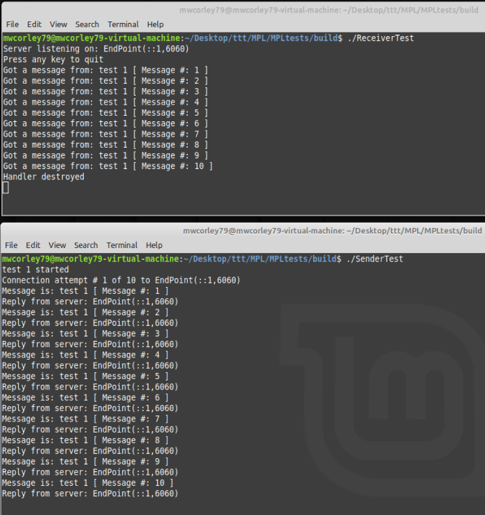
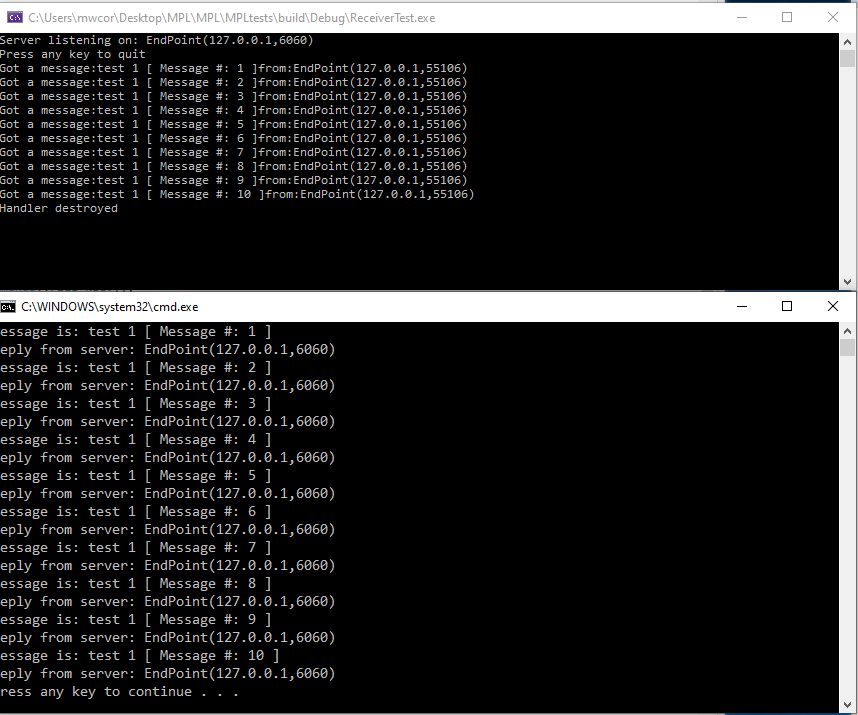
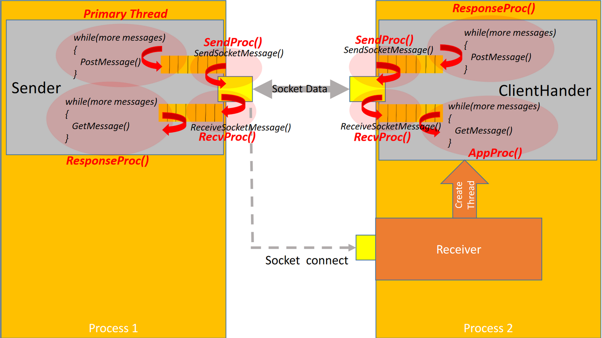

# Message Passing Library (MPL) 
Reusable message passing library (MPL) framework for developing network (client/server) applications.  Wraps full duplex TCP sockets On Linux and Windows.    
One goal is to enable cross-platform portability (TCP socket level compatibility between Linux and Windows) by providing a TCPSocket class that encapsulates the (basic) differences between the low-level (C-based) Windows and Linux APIs.    
<b> The See TCPSocket.h/.cpp for details on the TCP socket wrapper code. </b>   
This project uses CMake to manage the build process for Linux and Windows.     
The current objective of this repo is to provide an effcient C++ network communication facility for a joint effort with Dr. James Fawcett (https://github.com/JimFawcett) to compare various (initially performance related) aspects of modern C++ and the Rust programming language. 

<b>Prerequisites for getting started on Linux:</b>
<ol>
  <li> Download and install CMake (Debian-based distros): <b> sudo apt-get install cmake </b> </li>
  <li> Download and install git:   <b> sudo apt-get install git </b> </li>
  <li> Download and install Visual Studio Code editor (VScode): <b> https://code.visualstudio.com/download </b>
     <ol>
       <li> Start VScode and install Microsoft C/C++ VScode extension (ms-vscode.cpptools) </li>
       <li> Install Microsoft CMake Tools VScode extension (ms-vscode.cmake-tools) </li>
     </ol>
  </li>
  <li> Download and install gcc/g++ (compiler toolchain): <b> sudo apt-get install g++ </b> </li>
  <li> Open a terminal/console and type command: </b> git clone https://github.com/mwcorley79/MPL.git </b> </li>
</ol>
 
<b>Prerequisites for getting started on Windows:</b>
<ol>
  <li> Download and install CMake: https://cmake.org/download/</b> </li>
  <li> Download and install git:   <b> https://git-scm.com/download/win </b> </li>
  <li> Download and install Visual Studio Code editor (VScode): <b> https://code.visualstudio.com/download </b>
     <ol>
       <li> Start VScode and install Microsoft C/C++ VScode extension (ms-vscode.cpptools) </li>
       <li> Install Microsoft CMake Tools VScode extension (ms-vscode.cmake-tools) </li>
     </ol> 
  </li>
  <li> Download and install Microsoft C++ Build Tools  (MSVC compiler tools): <b> https://visualstudio.microsoft.com/visual-cpp-build-tools/ </b> 
     <ol>
       <li> Run vs_buildtools (Visual Studio) installer. Check the workload for C++ build tools 
             
       </li>
     </ol>
  </li>  
  <li> open a windows command prompt (cmd.exe) and the command: <b> git clone https://github.com/mwcorley79/MPL.git </b> </li>
</ol>

 

<b>  Setup the MPL CMake project in VScode (these steps apply to both Windows and Linux) </b>
<ol> 
  <li> Start VSCode: click File -> Open Folder and Select the project MPL folder
      
  </li>
  <li> As illusrated below, Select a compiler kit: (gcc/g++ for Linux), (Visual Studio Build Tools 2019 Release for Windows)  
      
      
  </li>
  
  
  
  
  <li> cd MPL && mkdir build && cd build </li>
  <li> cmake .. -DCMAKE_INSTALL_PREFIX=../install </li>
  <li> make install </li>
</ol>
<b> Testing the MPL library on Linux </b>
<ol>
  <li> From the same terminal from the previous step, type the following commands </li>
  <li> cd ../MPLtests && mkdir build && cd build </li>
  <li> cmake .. </li>
  <li> make all </li>
  The previous step should have produced two executable files: TCPConnectorTest (was previously SenderTest) and TCPResponderTest (was previously ReceiverTest).  
  <li> Open two (separate terminal windows and type ./TCPResponderTest in one terminal, and ./TCPConnectorTest in the other terminal
       This should produce output such as the following: (note: rpelace ReceiverTest with TCPResponderTest and SenderTest with TCPConnectorTest </li>
    
</ol> 

<b> Prerequisites for Windows </b>
  <ol>
    <li> Install CMake for Windows: https://cmake.org/download/ </li>
    <li> Visual Studio 2019 (installed, using as default generator)</li>
  </ol>
 <b> Build and install the MPL library on Windows: MPL.lib (static library installed in MPL/install/lib) </b>
  <ol> 
    <li> open a terminal/command window and type the following commands in the shell ... </li>
    <li> git clone https://github.com/mwcorley79/MPL.git </li>
    <li> cd MPL && mkdir build && cd build </li>
    <li> cmake .. -DCMAKE_INSTALL_PREFIX=../install
      <ol><li> this generate the Visual Studio solution and projects in "MPL/build" folder  
        and set install mpl library install folder to "MPL/INSTALL") </li></ol>
    </li>   
    <li>  Start Visual Studio 2019, choose "Open a Project or solution",  
          navigate to the "MPL/build" folder and open solution file (MPL.sln) 
    </li>
    <li> Right click on the "INSTALL" and click "Build"  
         Note: Leave Visual Studio and the terminal (from step 3) running
    </li>
  </ol>
  
  <b> Testing the MPL library on Windows </b>
  <ol> 
    <li> From the same terminal in step 3 (above), type the following: </li>
    <li> cd ../MPLtests && mkdir build && cd build </li>
    <li> cmake ..  
        (this generate the Visual Studio solution and projects in "MPL/MPLtests/build" folder)
    </li>
    <li>  From Visual Studion 2019, Right click "MPL" solution, and select: 
         "Add" -> "Existing Project".  Selected folder "MPLtests/build" and choose
          the "TCPResponderTest.vcxprog" project and click "Open"
    </li>
    <li> Repeat step 6, but substitute "TCPConnectorTest.vcxproj" for "TCPResponderTest.vcxprog" </li>
    <li> In Visual Studio, Right click "TCPResponderTest" -> "Build" </li>
    <li> In Visual Studio, Right click "TCPConnectorTest" -> "Build" </li>
    <li> Right click "TCPResponderTest" -> "Set as Startup Project" and type Ctrl-F5 </li>
    <li> Right click "TCPConnectorTest" -> "Set as Startup Project" and type Ctrl-F5 </li>
  <li> 
       This should produce output such as the following: </li>
         
  </ol>
   
     
  <H2>MPL Framework Synopsis:</H2>
  Three (3) primary classes comprise the framework: <b> TCPConnector (Sender) - </b> encapsulates client-side message passing. <b> TCPResponder (Receiver) </b> and <b> ClientHandler - </b>encapsulate server-side message passing. Full-duplex infers bidirectional communication in which both the Sender and (derived) ClientHandler instances support GetMessage() and PostMessage() operations simultaneously.  The following picture illustrates the high-level concept: 
    
