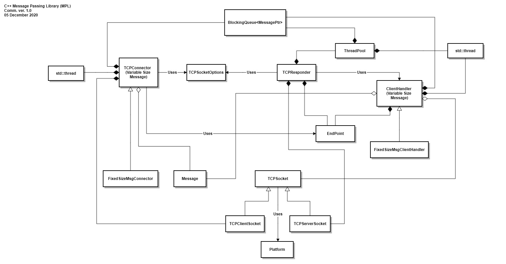

# Message Passing Library (MPL) 
This repository provides a reusable C++ message passing library (MPL) framework for developing TCP/IP network (client/server) applications by wrapping full duplex TCP socket communucation on Linux and Windows.    
One goal is to enable cross-platform portability (TCP socket level compatibility between Linux and Windows) by providing a TCPSocket class that encapsulates the (basic) differences between the low-level (C-based) Windows and Linux APIs.    
<b> See TCPSocket.h/.cpp for details of the TCP socket wrapper code. </b>   
This project uses CMake to manage the build process for Linux and Windows.     
The current objective is to provide an efficient C++ network communication facility for a joint experiment with Dr. James Fawcett (https://github.com/JimFawcett) to compare various (initially performance related) aspects of modern C++ and the Rust programming language. 

<b>Prerequisites for getting started on Linux:</b>
<ol>
  <li> Download and install CMake (Debian-based distros): <b> sudo apt-get install cmake </b> </li>
  <li> Download and install git:   <b> sudo apt-get install git </b> </li>
  <li> Download and install gcc/g++ (compiler toolchain): <b> sudo apt-get install g++ </b> </li>
  <li> Open a terminal/console and type command: <b> git clone https://github.com/mwcorley79/MPL.git </b> </li>
</ol>
 
<b>Prerequisites for getting started on Windows:</b>
<ol>
  <li> Download and install CMake: https://cmake.org/download/</b> </li>
  <li> Download and install git:   <b> https://git-scm.com/download/win </b> </li>
  
  <li> Download and install Microsoft C++ Build Tools  (MSVC compiler tools): <b> https://visualstudio.microsoft.com/visual-cpp-build-tools/ </b> 
     <ol>
       <li> Run vs_buildtools (Visual Studio) installer. Check the workload for C++ build tools (as shown below) 
             
       </li>
     </ol>
  </li>  
  <li> Open a windows command prompt (cmd.exe) and type command: <b> git clone https://github.com/mwcorley79/MPL.git </b> </li>
</ol>

<b>Option 1: Building the Cmake targets from the command line -- Debug and Release Mode  (these steps apply to both Windows and Linux) </b>
<ol> 
  <li> Open a command line terminal (i.e. bash in Linux) and (cmd.exe in Windows)
    <ul>
      <li> 
        <b> Building in Debug Mode </b> 
        <ol>
           <li> cd MPL </l>
           <li> mkdir debug </li>
           <li> cd debug </li>
           <li> cmake .. -DCMAKE_INSTALL_PREFIX=../install -DCMAKE_BUILD_TYPE=Debug </li>  
        </ol>
      </li>
      <li>
        <b> Building in Release Mode </b> 
        <ol>
           <li> cd MPL </l>
           <li> mkdir release </li>
           <li> cd release </li>
           <li> cmake .. -DCMAKE_INSTALL_PREFIX=../install -DCMAKE_BUILD_TYPE=Release </li>  
        </ol>  
     </li>
   </li>
   <li> 
     <b> Building CMake Project Targets: </b>
        <ul>
          <li> <b> Build all targets: </b> cmake --build . --target all </li>
          <li> <b> Build the (static) MPL Comm: </b> cmake --build . --target MPL  </li>
          <li> cmake --build . --target PerfTestCombinedFixedSizeMsg  <em> -- builds the fixed size message performance test </em> </li>
          <li> cmake --build . --target PerfTestCombinedVariableSizeMsg <em> -- builds the variable size message performance test </em> </li>    
          <li> cmake --build . --target BQueueTest  -- buil </li>
          <li> cmake --build . --target MessageTest </li>
          <li> cmake --build . --target TCPSocketsTest </li>
        </ul>
    </li>
 </ol>  
    

<b>Option 2: Use VScode with the CMake extension (these steps apply to both Windows and Linux) </b>
<ol> 
  <li> Download and install Visual Studio Code editor (VScode): <b> https://code.visualstudio.com/download </b>
     <ol>
       <li> Start VScode and install Microsoft C/C++ VScode extension (ms-vscode.cpptools) </li>
       <li> Install Microsoft CMake Tools VScode extension (ms-vscode.cmake-tools) </li>
     </ol> 
  </li>
  <li> Start VScode: click File -> Open Folder and Select the project MPL folder
      
  </li>
  <li> As illustrated (below): Select a compiler kit: (i.e. gcc/g++ for Linux, and Visual Studio Build Tools 2019 Release for Windows)  
     <b> ... on Linux ... </b>
      
    <b> ... and on Windows ... </b>
      
  </li>
   <li> As illustrated (below): Build the MPL (library) by selecting the MPL STATIC_LIBARY target and clicking "Build".
        On Windows this generates library: MPL.lib, and on Linux: libMPL.a
      
  </li> 
  <li> In similar fashion, build and run the included MPL performance test. Select and Build the TCPConnectorPerfTest EXECUTABLE target, and TCPResponderTest EXECULABLE target </li>
  <li>  As illustrated( below): run the MPL performace test on Windows by clicking the TERMINAL tab, and splitting the terminal into two   
        separate panes (as shown in the output).   Run the MPL performance exemplar by using the commands shown in the output.  
        The exemplar provides throughput/latency measurements for 1024 byte message sizes running on a Windows 10 virtual machine (VMWARE). 
    
  </li>
   <li> Run the MPL performace test on Linux by clicking the TERMINAL tab, and splitting the terminal into two   
        seperate panes (as shown in the output).   Run MPL performance exemplar by using the commands shown in the output.  
        The exemplar provides throughput/latency measurements for 1024 byte message sizes running on a Linux Mint virtual machine (VMWARE). 
    
  </li>
</ol>
 
 <b> Running the combined test target (PerfTestCombined) is complementary to Dr. Fawcett's testing of the same in Rust (located here: https://jimfawcett.github.io/RustCommWithThreadPool.html) </b>
<ol>
  <li> Start VScode: click File -> Open Folder and Select the project MPL folder
         
  </li>
  <li> Build the MPL (library) by selecting the MPL STATIC_LIBARY target and clicking "Build".
       On Windows this generates library: MPL.lib, and on Linux: libMPL.a
         
  </li> 
  <li> Build the PerfTestCombined target by selecting the PerfTestCombined EXECUTABLE target and clicking "Build".
         
  </li> 
  <li> Finally, Run the PerfTestCombined target by clicking Run (shown below) 
         
  </li> 
</ol>

<b> Getting started on Linux and Windows with CMake only (if you prefer not to use VSCode) </b>
<ul>
  <li> NOTE:  you will need a compiler toolchain (i.e. Build Tools - Windows,  gcc/g++ - Linux) </li>
  <li> cd MPL && mkdir build && cd build </li>
  <li> cmake .. -DCMAKE_INSTALL_PREFIX=../install </li>
  <li> make install </li>
  <li> Also: (** Windows only) you can use the (full) Visual Studio 2019 IDE </li>
 </ul>
 

    
   MPL class diagram
  
